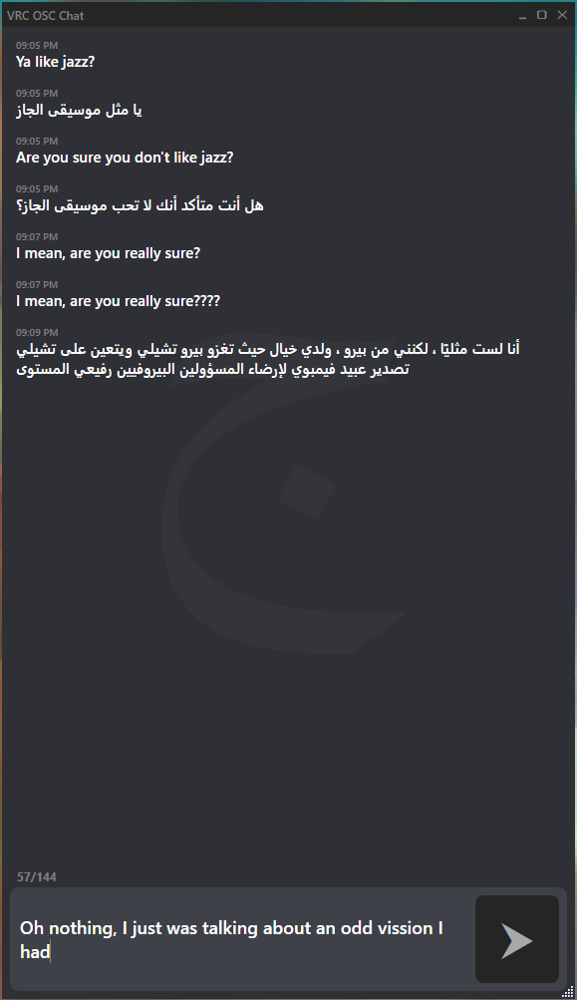

# VRC-OSC-Chat

Allows you to send both **English** and **Arabic** Messages in VRChat using OSC. 
As of now, Arabic messeges sent by the in-game keyboard are backwards, and the letters are not connected.

Using this software, Arabic messages are displayed properly: Words are written right to left, and letters are connected properly.

  

---
## Features
- Send messages in both **Arabic** and **Englsih**
- A **history** of all sent messages are saved per session. 
    - ***Left-clicking*** on an old message will copy it to the text box; you don't have to retype a message if someone wasn't looking.
    - ***Right-clicking*** will append an old message to what ever you have typed so far.
- An optional **auto-updater** version. This verion will automatically check for updates and prompt you, if you would like to install the latest release.

###### **NOTE**: This does not translate English to Arabic, or vice versa. 
---
## Download & Install
1. Goto to [latest release](https://github.com/MrKhan20b0/VRC-OSC-Chat/releases/latest)
2. download either `VRCOSCCHAT.zip` or `VRCOSCCHAT_with_auto_updater.zip`
3. Extract the your chosen zip file somewhere on your machine, and run `VRCChatBox.exe`.

4. *(opitional)* You may add a shortcut to `VRCChatBox.exe` to `%AppData%\Microsoft\Windows\Start Menu\Programs` if you would like the program to be visable in your start menu.

5. Make sure you have OSC enabled in VR Chat.
    - It Can be enabled in game by going to `options -> OSC -> Enable` in the radial menu.

#### `VRCOSCCHAT.zip` VS `VRCOSCCHAT_with_auto_updater.zip`
Both give the same version of VRCCHatBox.exe. However, `VRCOSCCHAT_with_auto_updater.zip` will check for updates upon startup. You will be prompted to install the updates if you would like.

This project is still a *work-in-progress*, so having the auto updater saves you the hassle of checking and manualling installing the latest release.

---
## Known Issues

- Long sentences in Arabic that need more than one line in VRChat message bubbles have to be read from the bottom-up. They can still be read right-to-left, though. I am searching for a solution.

- Unfortunatly a space takes up 2 character slots out of the 144 availble per message in VRCha. Arabic messages that require multiple lines to be displayed in VRChat will be rendered on top of eachother (Completely unreadable), unless the unicode "Arabic Character (U+061C)" is either just before or after the space. This additional character is not reflected in the character limit, so you may see your message be truncated in VRChat if the message is long with many spaces. I'm not sure if this can be solved.
---
## Contribution
Feel free to fork this repo and make any improvements you would like.
If you pull request back here, I'll add your name and what you've contributed to the Attribution section.

---
## Attribution

- Im using [PaciStardusts' fork](https://github.com/PaciStardust/CoreOSC-UTF8) of `CoreOSC.dll`.
It allows sending UTF8 encoded OSC messages, which is required to send Arabic characters.
The library was originally created by [Valdemar Örn Erlingsson](https://github.com/ValdemarOrn/SharpOSC)
